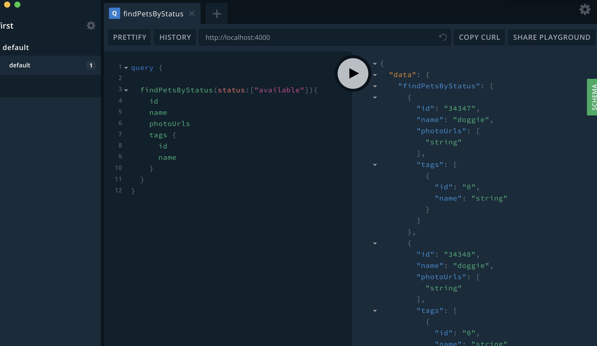

# graphql bindind with openapi 

> use demo petstore openapi

## How to Run (local)

* install deps

```code
yarn 

or npm install
```

* run

```code
yarn start
```

## How to Run (docker)

* build imaga

```code
docker-compose build
```

* run

```code
docker-compose up -d
```

* with build image

```code
docker run -d -p 4000:4000 dalongrong/graphql-binding-openapi
```

## some images

